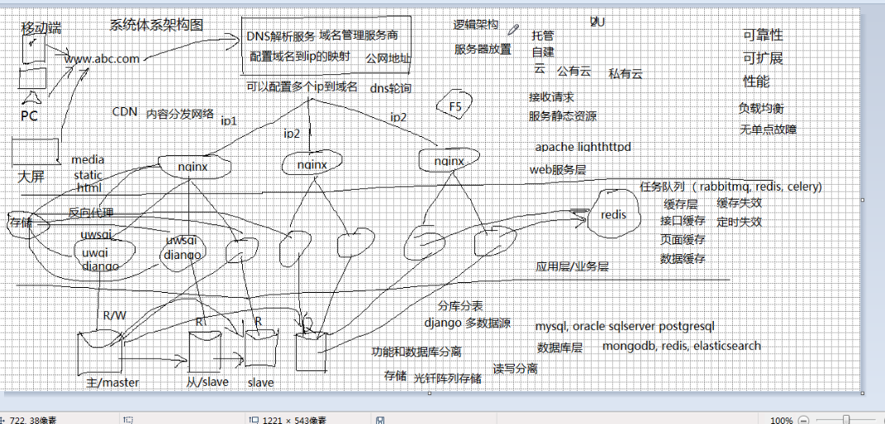
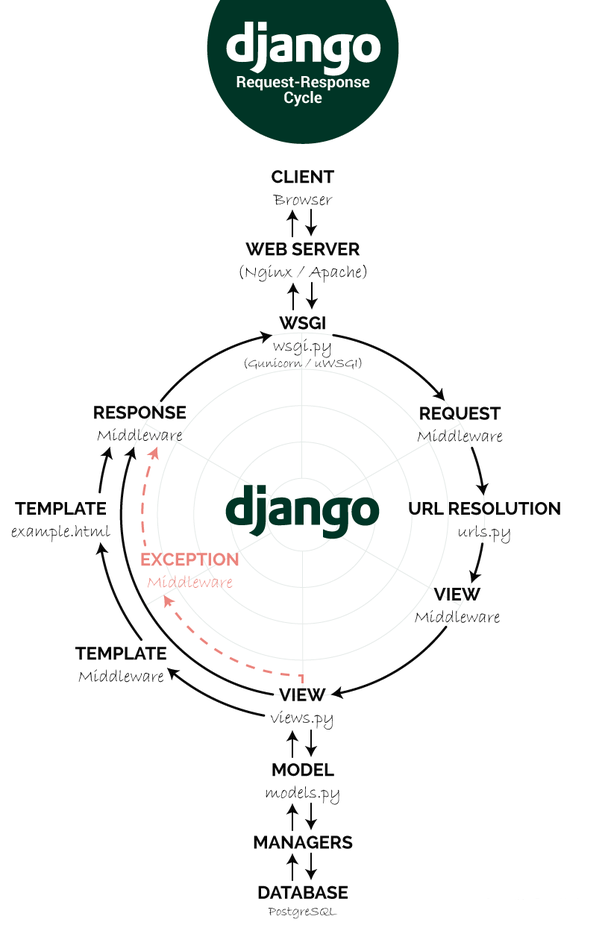

[TOC]

# Python Notes

python笔记与练习题

## Git

Permission demied, please try again.   没有设置 ssh key

在系统  cd ~/.ssh/

两文件 id_rsa 私钥   id_rsa.pub 公钥

在gitlab, 或者其它git仓库, 设置中填写ssh key (公钥内容)

如果没有.ssh, 则 mkdir ~/.ssh

cd .ssh

在.ssh路径下配置全局name和email

git config --global user.nbame  "XXX"

git config --global user.email "XXX@XXX"

输入 ssh-keygen -t rsa -C "XXX@XXX"

生成 id_rsa和id_rsa.pub

```python
git clone -b develop XXX   # develop 分支名 XXX 地址
git init # 初始化为git仓库
git add <file> #将工作区指定文件放入暂存区
git status  # 查看工作区和暂存区的状态
git diff  # 查看修改文件
git commit -m '提交原因' # 将暂存区的内容添加到仓库
git push  # 添加到远程仓库
git log . # 查看提交日志
git checkout --<file>  # 将暂存区文件恢复到工作区
git reset --hard HEAD^ # 回到上一个版本
git reset --hard <ID> # 回到指定版本
git reflog  # 查看历史和未来版本
git pull  # 将服务器更新同步到本地
git fetch # 从远程获取最新到本地,不会自动merge
git fetch orgin master #将远程仓库的master分支 下载到本地当前branch中
git log -p master ..orgin/master # 比较本地master分支和origin/master分支的差别
git merge orign/master  # 进行合并
git fetch origin master : tmp 从远程仓库master分支获取最新在本地建立tmp分支
git diff tmp # 当前分支与tmp对比
git merge tmp # 合并tmp分支到当前分支

git branch 分支名  # 创建分支
git btanch -a # 查看所有分支
git branch -d # 删除分支
           -D # 强删
git commit --amend # 重新提交

git commit -m 'initial commit'
git add forgotten -file
git commit --amend

git reset  # 产生一个新的commit  安全
git revert

svn # 集中式
git # 分布式
pyc # 编译文件

with # 省掉关闭

Scrum
Product Backlog  # 头脑风暴
Sprint Backlog # 迭代周期
Daily metting # 站立会议
burn down # 燃烬
review meeting
release

```


##  简单的系统体系架构图





## 进程、线程、协程


Python中实现并发编程的三种方案：多线程、多进程和异步I/O。

1. 什么是进程？

   ​    一个正在运行的应用程序就是一个进程。

   ​    系统会给每个进程分配一个独立的内存区域，用来保存程序运行过程中产生的数据，当进程结束的时候，这个内存区域会自动销毁。

   ​    进程之间内存是不共享的，进程间通信有两种主要形式，队列（queue）和管道（pipe）。

   ​    

   ​    python中有GIL来防止多个线程同时执行本地字节码，这个锁对CPython是必须的，因为CPython的内存管理并不是线程安全的，因为GIL的存在多线程并不能发挥CPU的多核特性。

   ​    Python中的多线程无法利用多核优势 , 所以如果我们想要充分地使用多核CPU的资源 , 那么就只能靠多进程了

   multiprocessing模块中提供了Process , Queue , Pipe , Lock , RLock , Event , Condition等组件 , 与threading模块有很多相似之处

   ​    对于计算密集型任务应该考虑使用多进程。

2. 什么是线程？

   ​    进程想要执行业务，就必须要有线程。每个进程默认都有一个线程,这个线程叫主线程;其它的线程叫子线程,默认都是在主线程中执行的。
   
   ​    一个线程中执行多个任务，任务是串行执行的。（一个一个按顺序执行）
   
   ​    一个进程中如果有多个线程，多线程执行不同任务的时候是并行。（同时执行）
   
   ​    进程内所有线程都共享地址空间，但每个线程有自己的栈空间。
   
3. 多线程和多进程的比较

   以下情况需要使用多线程：

   - 程序需要维护许多共享的状态（尤其是可变状态），python中的列表、字典、集合都是线程安全的，所以使用线程而不是进程维护共享状态的代价相对较小。

   - 程序会花费大量时间在I/O操作上，没有太多并行计算的需求且不需占用太多的内存。

   
   以下情况需要使用多进程:
   
   - 程序执行计算密集型任务（如：字节码操作，数据处理，科学计算）。
   - 程序的输入可以并行成块，并且可以将运算结果合并。
   - 程序在内存使用方面没有任何限制且不强依赖于I/O操作。（如：读写文件，套接字）。
   
4. 什么是协程？

   ​    协程又称微线程，纤程，协程是一种用户态的轻量级线程。即，协程由用户自己控制调度。

   协程拥有自己的寄存器上下文和栈。协程调度切换时，将寄存器上下文和栈保存到其它地方，在切换回来的时候，恢复先前保存的寄存器上下文和栈。

   ​    因此，协程能保留上次调用时的状态，即所有局部态的特定组合，每次过程重入时，就相当于进入上一次调用状态。

   ​    协程本质上个单进程，协程相对于多进程说，无需线程上下文切换的开销，无需原子操作锁定及同步的开销，编程模型也简单。（并发却不并行）

   优点：

   - 协程的切换开销更小，属于程序级别的切换，更加轻量级。
   - 单线程内就可以实现并发的效果，最大限度利用CPU。

   缺点：

   - 协程的本质是单线程下，无法利用多核，可以是一个程序开启多个进程，每个进程内开启多个线程，每个线程内开启协程。
   - 协程指的是单个线程，因而一旦协程出现阻塞，将会阻塞整个线程。

   Greenlet

   greenlet 是一个用C实现的协程模块，相比与Python自带的yield，它可以使你在任意函数之间随意切换，而不需把这个函数先声明为generator。
   
   手动切换
   
   ```python
   from greenlet import greenlet
   
   def test1():
       print(12)
       gr2.switch()      #到这里切换到gr2，执行test2（）
       print(34)
       gr2.switch()      #切换到上次gr2运行的位置
   
   def test2():
       print(56)
       gr1.switch()      #切换到上次gr1运行的位置
       print(78)
   
   gr1 = greenlet(test1)      #启动一个协程gr1
   gr2 = greenlet(test2)      #启动一个协程gr2
   
   gr1.switch()        #开始运行gr1
   ```
   
   

## Pyhton中怎样使用多线程？

python通过内置的threading模块来提供多线程相关技术;
其中有一个Thread类,这个类的对象就是线程对象.
直接创建线程类的对象

线程对象 = Thread(target = 函数, args = 参数)

函数  -- function 类型的变量;(这个 函数的函数体会在子线程中执行)

参数  -- 元组; 参数会传给target对应的函数

让线程开始执行任务

线程对象.start()

```python
def download(film):
    print(f'开始下载: {film}')
    
t1 = threading.Thread(target = download, args = ('小猪佩奇',))
t2 = threading.Thread(target = download, args = ('霸王别姬',))

t1.start()
t2.start()
```

某个线程出现异常,是线程直接结束,进程不一定结束。

所有的线程都结束，进程才会结束。

```python
import threading
import time


def f():
    print('start f')
    time.sleep(2)
    print('end f')
    
def main():
    thread = threading.Thread(target = f)
    thread.start()

if __name__ == '__main__':
    main()
```

```python
import threading
import random


result = []


def f():
    result.append(sum([random.randint(1,100) for i in range(10000)]))
    print(result)

    
threads = [threading.Thread(target=f) for _ in range(8)]
for thread in threads:
    thread.start()
for thread in threads:
    thread.join()
print(result)
```

多进程

```python

import time
from multiprocessing import Process


def f():
    print('enter f')
    time.sleep(2)
    print('exit f')


def main():
    p = Process(target=f)
    p.start()
    p.join()
    print('exit main')


if __name__ == "__main__":
    main()
```

```python
# TODO
# 此代码有问题,待调试
import multiprocessing
import random


def f(n):
    print('Hello, word!')
    result = sum([random.randint(1,100) for i in range(10000)])
    print('got result %d', n)
    return result


pool = multiprocessing.Pool(processes = 8)

result = pool.map(f,range(10))
print(result)

```

```python
from multprocessingfrom multiprocessing import Process
import random


result = []


def f():
    result.append(sum([random.randint(1,100) for i in range(100000)]))
    print(result)


def main():
    processes = [Process(target=f) for _ in range(8)]

    for process in processes:
        process.start()
    for process in processes:
        process.join()


if __name__ == '__main__':
    main()
```

进程,管道

```python
from multiprocessing import Process, Queue

def f(q):
    print ('enter f')
    q.put('Roctey')
    print('exit f')


def main():
    q = Queue()
    q.put('carmark')
    process = Process(target=f, args=(q,))
    process.start()
    process.join()
    while (not q.empty()):
        print(q.get_nowait())


if __name__ == '__main__':
    main()
```

进程,锁

```python
import random
import time
from multiprocessing import Process, Lock


def f(i, lock):
    lock.acquire() # 获取锁
    time.sleep(random.randint(1,3))
    print(i)
    lock.release()  # 释放锁


def main():
    lock = Lock()
    processes = [Process(target=f, args=(i, lock)) for i in range(20)]
    for process in processes:
        process.start()


if __name__ == '__main__':
    main()
```


## 装饰器

  装饰器本质上是一个pyhton函数，它可以让其它函数在不需要做任何代码变动的前提下增加额外功能，装饰器的返回值也是一个函数对象。它经常用于有切面需求的场景，比如：插入日志，性能测试，事务处理，缓存，权限校验等场景。

  装饰器是解决这类问题的绝佳设计，有了装饰器，我们就可以抽离出大量与函数功能本身无关的雷同代码并继续重用。

  概括的讲，装饰器的作用就是为存在的对象添加额外的功能。


```python
# record_time 是一个装饰器函数(装饰别的函数或者类的函数)
# 如果装饰器用来装饰函数,那么它的参数就是被装饰的函数(func)
from time import time
def record_time(func):
    # 装饰器内嵌的wrapper函数是带装饰功能的函数
    # 它除了执行被装饰的函数之外,还要执行额外的代码
    def wrapper(*args, **kwargs):
        # 在执行被装饰的函数之前要做什么
        start = time()
        result = func(*args, **kwargs)
        end = time()
        print(f'执行时间:{end - start}秒')
        # 在执行完被装饰的函数之后要做什么
        
        return result
    return wrapper

@record_time
def foo(a, b):
    return a ** b

foo(5,6)

```

```python
from functools import wraps


def retry(tries=1, errors=(Exception)):
    def outer(func):
        
        @wraps(func):
            def inner(*args, **kwargs):
                for _ in range(tries):
                    try:
                        return func(*args,**kwargs)
                    except errors:
                        pass
        return inner
    return outer

@retry()
def foo():
    pass

```


## 迭代器和生成器

### 1.概念

 **迭代器协议**

- 迭代器协议：对象需要提供next方法，它要么返回迭代中的下一项，要么引起一个StopIteration异常，以终止迭代
- 可迭代对象：实现了迭代器协议的对象

 **迭代器**

-   迭代器是python提供的容器型数据类型。
- 不管以任何形式获取了迭代器中某个元素的值，这个元素都会从迭代器中消失。

- 迭代器是访问集合内元素的一种方式，一般用来遍历数据
- 迭代器和以下标的访问方式不一样，迭代器是不能返回的（比如下标方式 list[2],之后可以访问list[0],list[1]，而迭代器不能返回，只能`__next__`），迭代器提供了一种惰性方式获取数据（就是只有在访问数据的时候才去计算或者说才去获取数据）

**生成器**

- python使用生成器对延迟操作提供了支持，所谓延迟操作，是指在需要的时候才产生结果，而不是立即产生结果。这也是生成器的主要好处,消耗的内存数量就大大减小。
-  生成器就是迭代器,但是迭代器不一定是生成器。

**生成器函数**

- 与常规函数不同的是：使用yield语句而不是return语句返回结果。yield语句一次返回一个结果，在每个结果中间，挂起函数，下次执行的时候，从上一次挂起地方开始。

**生成器表达式**

- 返回的是一个生成器对象，这个对象只有在需要的时候才产生结果

### 2. 迭代器必须实现iter()方法

Python中 list，truple，str，dict这些都可以被迭代，但他们并不是迭代器。为什么？

因为和迭代器相比有一个很大的不同，list/truple/map/dict这些数据的大小是确定的，也就是说有多少事可知的。但迭代器不是，迭代器不知道要执行多少次，所以可以理解为不知道有多少个元素，每调用一次next()，就会往下走一步，是惰性的。

- Iterable：判断是不是可以迭代
- Iterator：判断是不是迭代器

```javascript
from collections.abc import Iterable,Iterator

a = [1,2,]

print(isinstance(a,Iterable))    #True    list是可迭代的
print(isinstance(a,Iterator))    #False   list不是迭代器 
```

 通过iter()方法，获取iterator对象

```javascript
from collections.abc import Iterable,Iterator

a = [1,2,]

iter_rator = iter(a)
print(isinstance(a,Iterable))             #True         可迭代的
print(isinstance(iter_rator,Iterator))    # True        迭代器


print(isinstance((x for x in range(10)),Iterator))     #True


# 总结

# 凡是可以for循环的，都是Iterable

# 凡是可以next()的，都是Iterator

# list，truple，dict，str，都是Itrable不是Iterator，但可以通过iter()函数获得一个Iterator对象
class Iterable(metaclass=ABCMeta):

    __slots__ = ()

    @abstractmethod
    def __iter__(self):
        while False:
            yield None

    @classmethod
    def __subclasshook__(cls, C):
        if cls is Iterable:
            return _check_methods(C, "__iter__")
        return NotImplemented
```

### 3.自定义迭代器

通过自定义一个迭代器，进一步说明什么是迭代器，什么是可迭代对象

```javascript
from collections.abc import Iterator

class Company(object):
    def __init__(self, employee_list):
        self.employee = employee_list

    def __iter__(self):
        return MyIterator(self.employee)

#自定义迭代器
class MyIterator(Iterator):         #如果不继承Iterator，则必须实现__iter__方法
    def __init__(self, employee_list):
        self.iter_list = employee_list
        self.index = 0   #初始化索引位置

    def __next__(self):
        #真正返回迭代值的逻辑
        try:
            word = self.iter_list[self.index]
        except IndexError:
            raise StopIteration
        self.index += 1
        return word

if __name__ == "__main__":
    company = Company(["derek1", "derek2", "derek3"])
    my_itor = iter(company)
    
    print(next(my_itor))     #derek1
    print(next(my_itor))     #derek2
    print(next(my_itor))     #derek3
    
    for item in company:
        print (item)         #derek1  derek2  derek3
```

###  4.生成器函数的使用

 （1）生成器函数和普通函数的区别

```javascript
#函数里只要有yield关键字，就是生成器函数
def gen_func():
    yield 1

def func():
    return 1


if __name__ == '__main__':
    
    gen = gen_func()   
    print(type(gen))     #<class 'generator'>   返回的是一个生成器对象
    
    res = func()
    print(type(res))     #<class 'int'>    返回1
    pass
```

 （2）取出生成器里面的值

```javascript
#函数里只要有yield关键字，就是生成器函数
def gen_func():
    yield 1
    yield 2
    yield 3


if __name__ == '__main__':

    gen = gen_func()
    print(type(gen))     #<class 'generator'>   返回的是一个生成器对象

    for value in gen:
        print(value)     # 1,2,3
```

 （3）斐波那契的例子

```javascript
def fib(index):
    re_list = []
    n,a,b = 0,0,1
    while n < index:
        re_list.append(b)
        a,b = b, a+b
        n += 1
    return re_list

print(fib(10))    #[1, 1, 2, 3, 5, 8, 13, 21, 34, 55]
```

 假如当数据量非常大的时候，这样全部打印会消耗非常大的内存，下面使用yield，虽然同样是获取数据，但是它实际上是不消耗内存的

```javascript
def gen_fib(index):
    n,a,b = 0,0,1
    while n < index:
        yield b       
        a,b = b, a+b
        n += 1

for data in gen_fib(10):
    print(data)   # 1, 1, 2, 3, 5, 8, 13, 21, 34, 55
```

## 正则

## Liunx

### 以下符号在LINUX下代表什么文件：p , l, c, d, s

d：表示是一个目录（directory），事实上在ext2fs中，目录是一个特殊的文件。
－：表示这是一个普通的文件。
l: 表示这是一个符号链接(symbol link)文件，实际上它指向另一个文件。
b、c：分别表示区块(block)设备和字符（character）设备，是特殊类型的文件。
s、p：这些文件关系到系统的数据结构和管道(pipe)，通常很少见到。

### 底下的目录与主要放置什么数据:

- /etc/: 几乎系统的所有配置文件案均在此,尤其 passwd,shadow

- /boot: 开机配置文件,也是预设摆放核心 vmlinuz的地方

- /usr/bin,/bin: 一般执行档摆放的地方

- /usr/sbin,/sbin: 系统管理员常用指令集

- /dev: 摆放所有系统装置文件的目录

- /var/log: 摆放系统注册表文件的地方

- /run: CentOS 7 以后才有,将经常变动的项目 (每次开机都不同,如程序的PID)移动到内存暂存,所以/run并不占实际磁盘容量


### liunx常用命令

TODO

- w/who/who am i/last
- adduser/passwd

- jobs
- crontab
- crontab -e  编辑克龙表
- df -h 查看磁盘空间
- fdisk 操作文件分区表
- sar 查看系统活动信息
- free 内存使用状况
- ifconfig
- netstat -nap | grep <端口号进程>

### liunx文件相关命令

TODO

### vim 常用命令

TODO

- jobs

- crontab

- crontab -e  编辑克龙表

- df -h 查看磁盘空间

- fdisk 操作文件分区表

- sar 查看系统活动信息

- free 内存使用状况

- ifconfig

- netstat -nap | grep <端口号进程>

  

## python常用web框架的特点

- **Flask 框架**

  轻量级web框架，灵活，但是功能少，需要使用许多三方插件。

- **Django框架**

  重量级web框架，集成程度高，研发周期短，但是限制了开发自由度，适合常规项目。

- **Tornado框架**

  可以加深对异步编程的理解，并发性高。

## Django 流程



### ORM

Object Relational Mapping (对象关系映射)

在编程中,把面向对象的概念和数据库中表的概念对应起来。

隔离了数据层和业务逻辑层，方便数据库切换。

用ORM的好处就是不用操作表，可以在程序中用面向对象的思路，直接操作对象。

### MVC

M  model 封装了对数据层的操作 （crud）

V view 封装结果，生成展示的html内容

C controller 用于接收请求，处理业务逻辑 与model，view 交互返回结果

### MTV 

M 同 MTV M

T  同 MTV V

V 同 MTV C

### 迁移

```
python manage.py makemigrations <appname>
python manage.py migrate
```

### 反向迁移

```
python manage.py inspectdb > <appname>/models.py
```

### nginx

是一个高性能的HTTP和反向代理服务器.

### uwsgi

实现wsgi协议(Web Server Gateway Interface )，它是nginx web 服务器与应用服务器之间的桥梁。

### restful

URL定位资源，用HTTP动词（GET, POST, DELETE, PATCH）描述操作。

网络上的所有事物都被抽象为资源

每个资源都有一个唯一的资源标准符

同一个资源具有多种表现形式（xml，json等）

对资源的各种操作不会改变资源标识符

所有的操作都是无状态的

符合REST原则的架构方式，即可称为RESTFUL

## 数据库

### left join（左联接）

返回包括左表中的所有记录和右表中联结字段相等的记录，右表只会显示符合搜索条件的记录，右表不足的地方均为NULL。

### right join（右联接）

返回包括右表中的所有记录和左表中联结字段相等的记录，以右表为基础的，左表不足的地方用NULL填充。

### inner join（内联接）

只返回两个表中联结字段相等的行


### 数据库三范式

1. 要求数据库表的每一列都是不可分割的原子数据
2. 每个表必须有主键，每个字段跟主键相关
3. 消除冗余信息

### 反三范式

比如：加一项某用户总贴数，用户发帖总数，发一个加一个。

### 缓存穿透

缓存穿透指查询一个一定不存在的数据,由于缓存是不命中时,需要从数据库查询, 查不到数据则不写入缓存,这将导致这个不存在的数据每次请求都要到数据库去查询,造成缓存穿透。

解决办法：

1. 布隆过滤器
2. 缓存空对象，将null变成一个值

### 缓存雪崩

如果缓存集中在一段时间内失效,发生大量的缓存穿透,所有的查询都落在数据库上,造成了缓存雪崩。

解决办法：

让失效时间均匀分布


## 面向对象设计七大原则

1. 单一职责原则(SRP)

   系统中的每一个对象都应该只有一个单独的职责，而所有的对象所关注的就 是自身职责的完成。（Single Responsibility Principle,SRP）

2. 里氏替换原则(LSP) 

   在任何父类出现的地方都可以用它的子类来替代。（Liskov Substitution Principle,LSP），其意思就是：同一继承体系中的对象应该有共同的行为特征。 （子类中方法的前置条件必须与父类中被覆写的前置条件相同或更宽。）

3. 依赖注入原则（DIP）

   要 依 赖 于 抽 象 ， 不 要 依 赖 于 具 体 的 实 现 。 （ Dependence Inversion Principle,DIP,依赖反转原则）。

   依赖注入原则有如下三点说明: 

   1）高层模块不应该依赖低层模块，两者都应该依赖于抽象（抽象类或接口）。 

   2）抽象（抽象类或接口）不应该依赖于细节（具体实现类）。 

   3）细节（具体实现类）应该依赖于抽象。

    依赖注入原则用如下三种方式实现： 

   1）通过构造函数传递依赖对象。 

   2）通过 setter 方法传递依赖对象。 

   3）接口声明实现依赖对象。

4. 接口分离原则（ISP）

   不应该强迫客户程序依赖它们不需要使用的方法。（Interface Segregation Principle，ISP）。接口有如下两种：对象接口、类接口。

5. 迪米特原则（LOD）

   一个对象应当对其他对象尽可能少的了解。（Law of Demeter，LOD）。 

   注意事项： 

   1）在类的划分上，应该创建有弱耦合的类。

    2）在类的结构设计上，每一个类都应当尽量降低成员的访问权限。 

   3）在类的设计上，只要有可能，一个类应当设计成不变类。 

   4）在对其他类的引用上，一个对象对其他对象的引用应当降低到最低。 

   5）尽量降低类的访问权限。

    6）谨慎使用序列化功能。 

   7）不要暴露类成员，而应该提供相应的访问器（属性）。

6. 开闭原则（OCP）

   一个对象对扩展开放，对修改关闭。（Open for Extension，Closed for Modification）。

7. 组合/聚合复用原则

   尽量使用合成/聚合达到复用,尽量少用继承。

   原则：一个类中有另一个类的对象。

## Scrapy 工作流程

### 流程图

TODO

### 过程

Scrapy 中数据流由执行引擎控制,其过程如下:

TODO


### urllib与urllib2的区别

urilb2 可以接受一个request类的实例来设置url请求的headers

urllib 仅可以接受url, 这意味着,你不可以通过urllib模块伪装你的User Agent 字符串

urllib 提供urlencode方法用来GET查询字符串的产生, 而urllib2没有.

这是为何urllib常和urllib2一起使用的原因.


##  Python开发工程师笔试题

1. 下面的Python代码会输出什么。

   ```python
   print([(x, y) for x, y in zip('abcd', (1, 2, 3, 4, 5))])
   print({x: f'item{x ** 2}' for x in range(5) if x % 2})
   print(len({x for x in 'hello world' if x not in 'abcdefg'}))
   ```

   答案：

   ```python
   [('a', 1), ('b', 2), ('c', 3), ('d', 4)]
   {1: 'item1', 3: 'item9'}
   6
   ```

2. 下面的Python代码会输出什么。

   ```python
   from functools import reduce
   
   items = [11, 12, 13, 14] 
   print(reduce(int.__mul__, map(lambda x: x // 2, filter(lambda x: x ** 2 > 150, items))))
   ```

   答案：

   ```python
   42
   # python高阶函数处理数据:过滤, 映射, 归约
   # 一行代码求阶乘
   from functools import reduce
   
   (lambda num:reduce(int.__mul__, range(1, num+1)))(5)
   ```

   

3. 有一个通过网络获取数据的Python函数（可能会因为网络或其他原因出现异常），写一个装饰器让这个函数在出现异常时可以重新执行，但尝试重新执行的次数不得超过指定的最大次数。

   答案：

   ```python
   from functools import wraps
   
   
   def retry(tries=1, errors=(Exception)):
       def outer(func):
           
           @wraps(func):
               def inner(*args, **kwargs):
                   for _ in range(tries):
                       try:
                           return func(*args,**kwargs)
                       except errors:
                           pass
           return inner
       return outer
   
   @retry()
   def foo():
       pass
   ```

4. 下面的字典中保存了某些公司今日的股票代码及价格，用一句Python代码从中找出价格最高的股票对应的股票代码，用一句Python代码创建股票价格大于100的股票组成的新字典。

   > 说明：美股的股票代码是指英文字母代码，如：AAPL、GOOG。

   ```
   TODO
   ```

   答案：

5. 写一个函数，传入的参数是一个列表，如果列表中的三个元素`a`、`b`、`c`相加之和为`0`，就将这个三个元素组成一个三元组，最后该函数返回一个包含了所有这样的三元组的列表。例如：

   > 参数：`[-1, 0, 1, 2, -1, -4]`
   >
   > 返回：`[(-1, 0, 1), (-1, 2, -1)]`

   答案：TODO

6. 写一个函数，传入的参数是一个列表（列表中的元素可能也是一个列表），返回该列表最大的嵌套深度，例如：

   > 参数：`[1, 2, 3]`
   >
   > 返回：`1`
   >
   > 参数：`[[1], [2, [3]]]`
   >
   > 返回：`3`

   答案：TODO

7. 写一个函数，实现将输入的长链接转换成短链接，每个长链接对应的短链接必须是独一无二的且每个长链接只应该对应到一个短链接，假设短链接统一以`http://t.cn/`开头。例如：给定一个长链接：，会返回形如：的短链接。

   > 参数：`http://jackfrued.xyz/api/users/10001`
   >
   > 返回：`http://t.cn/E6MUth1`

   答案：TODO

8. 用5个线程，将1~100的整数累加到一个初始值为0的变量上，每次累加时将线程ID和本次累加后的结果打印出来。

   答案：TODO

   ```
   from Threading inport Thread
   def sumnum():
       return sum(range(101))
   threads = Thread(target=sumnum, for _ in range(5))
   for thread in threads:
       thread.start()
   for thread in threads:
       thread.join()
   ```

9. 请阐述Python是如何进行内存管理的。

   答案：

   ```python
   '''
   垃圾回收,循环引用和弱引用
   python使用了自动化内存管理,
   这种管理机制以'引用计数'为基础,
   同时也引用了'标记-清除'和'分代收集'
   两种机制为辅的策略
   
   导致引用计数+1的情况:
   对象被创建  a=23
   对象被引用  b=a
   对象被作为一个参数,传入到一个函数  f(a)
   对象作为一个元素,存储在容器中 list1 = [a,b]
   
   导致引用计数-1的情况:
   对象的别名被显示销毁  delete a
   对象的别名被赋予新的对象  a=24
   一个对象离开它的作用域,  例如f函数执行完毕时,f函数中的局部变量(全局变量不会)
   对象所在的容器被销毁,或从容器中删除对象
   
   引用计数可能会导致循环引用问题,而循环引用会导致内存泄漏,
   为解决这个问题,python中引入了'标记-清除'和'分代收集'
   
   以下情况会导致垃圾回收
   调用 gc.collect()
   gc模块的引用计数器达到阈值
   程序退出
   
   ​```
   ```

10. 在MySQL数据库中有名为`tb_result`的表如下所示，请写出能查询出如下所示结果的SQL。

    `tb_result`表：

    | rq         | shengfu |
    | ---------- | ------- |
    | 2017-04-09 | 胜      |
    | 2017-04-09 | 胜      |
    | 2017-04-09 | 负      |
    | 2017-04-09 | 负      |
    | 2017-04-10 | 胜      |
    | 2017-04-10 | 负      |
    | 2017-04-10 | 负      |

    查询结果：

    | rq         | 胜   | 负   |
    | ---------- | ---- | ---- |
    | 2017-04-09 | 2    | 2    |
    | 2017-04-10 | 1    | 2    |

    答案：TODO

    ```
    
    ```

11. 列举出你知道的HTTP请求头选项并说明其作用。

    答案：TODO

    ```
    URL: 请求地址
    MEthod: 请求方式
    Code: 状态码
    User-Agent: 用户浏览器
    ```

12. 阐述Web应用中的Cookie和Session到底有什么区别和联系。

    答案：TODO

    ```
    
    ```

13. 请阐述访问一个用Django或Flask开发的Web应用，从用户在浏览器中输入网址回车到浏览器收到Web页面的整个过程中，到底发生了哪些事情，越详细越好。

    答案：TODO

    ```
    浏览器发送请求给服务器,
    ```

14. 请阐述HTTPS的工作原理，并说明该协议与HTTP之间的区别。

    答案：TODO

    ```
    超文本传输协议 HTTP 协议被用于在Web浏览器和网站服务器之间传递信息,HTTP协议以明文方式发送内容,不提供任何方式的数据加密.
    安全套接字层超文本传输协议 HTTPS 是在HTTP的基础上加入了SSL协议,SSL依靠证书来验证服务器的身份,并为浏览器和服务器之间的通信加密.
    ```

15. 简述你认为新浪微博是如何让订阅者在第一时间获得博主发布的消息。

    答案：TODO

16. 简述如何检查数据库是不是系统的性能瓶颈以及你在工作中是如何优化数据库操作性能的。

    答案：TODO

    ```
    1. 写慢查询日志,记录低效率SQL语句
    2. 查看explain 为需要的字段建索引
    3. 数据库读写分离
    ```

17. 在Linux系统中，假设Nginx的访问日志位于`/var/log/nginx/access.log`，该文件的每一行代表一条访问记录，每一行都由若干列（以制表键分隔）构成，其中第1列记录了访问者的IP地址。请用一条命令找出最近的100000次访问中，访问频率最高的IP地址及访问次数。

    答案：

    ```python
    tail -100000 /var/log/nginx/access.log | awk '{print $1}' | sort | uniq -c | sort -nr | head -1
    ```

    

18. 请阐述跨站脚本攻击（XSS）、跨站身份伪造（CSRF）和SQL注射攻击的原理及防范措施。

    答案:

    ```python
    '''
    1. 跨站脚本攻击(XSS)
    
    对提交的内容进行消毒
    
    2. 跨站身份伪造(CSRF)
    
    使用随机令牌
    
    3.SQL注射攻击
    
    不拼接SQL语句,避免使用单引号
    
    4. 点击劫持攻击
    
    不允许<iframe>加载非同源站点内容
    
    '''
    ```

    

19. 斐波那契数列

    ```python
    # 递归要点:
    # 1. 收敛条件 -- 什么时候停止递归
    # 2. 递归公式 -- 当前轮次跟前轮次的关系
    TODO
    
    # 阶乘
    TODO
    ```

    

20. 约瑟夫环

    ```python
    TODO
    ```

21. 冒泡排序

    ```python
    TODO
    ```

22. 快速排序TODO

23. 并归排序TODO

24. 单例模式TODO

25. 装饰器实现线程安全单例模式TODO

26. 假如一个人上楼梯,一次可以上1级台阶,也可以上2级台阶,求该上一个n级台阶共有多少种跳法?

    ```python
    from functools import lru_cache
    
    
    @lru_cache()
    def climb(num):
        if num == 0:
            return 1
        elif num< 0:
            return 0
        return climb(num - 1)+ climb(num - 2)
    
    # 不使用递归
    def climb():
        a, b = 1, 2
        for _ in range(num-1):
            a, b = b, a + b
        return a
    
    ```

    

